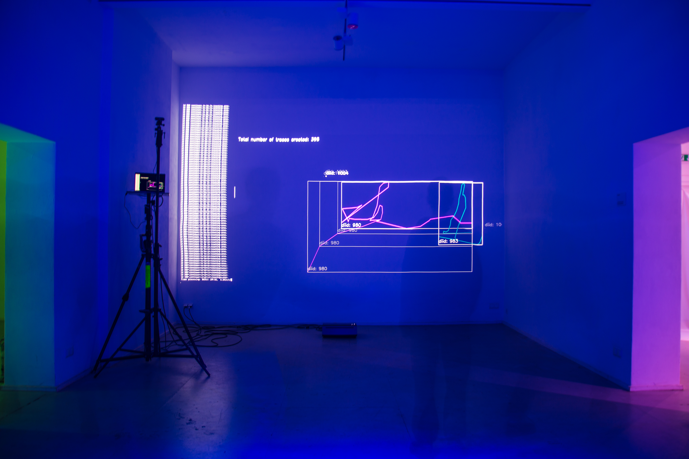

# diid2 motion tracker

### System requirements

-   Availability of Python version 3.8 or higher.

-   Connected camera device

### Installation and Initial Setup

- Source files need to be added to local device. Terminal command:
  ~~~
  git clone https://github.com/StrgFJojo/diid2.git
  ~~~

- After navigating to the project directory...
  ~~~
  cd diid2
  ~~~
- ...dependencies need to be installed.
  ~~~
    python3 -m venv venv
    source venv/bin/activate
    pip install -r requirements.txt
  ~~~

### Operating Command
- After setting up, you can start the program with the following command:
  ~~~
  python3 -m main --video 0
  ~~~
- Make sure you run this command while being in the project directory!

### Examples
Frappant Gallery, Hamburg. 2022.

